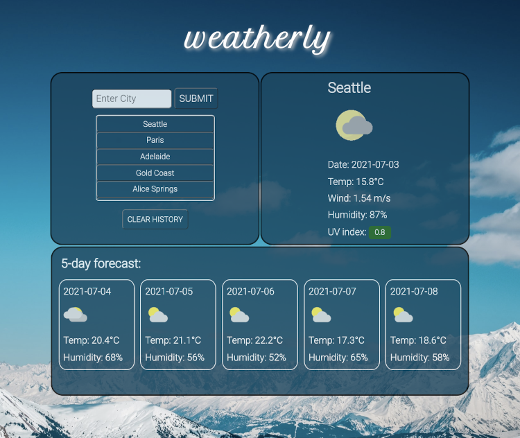

Weatherly is a weather app that presents the weather and 5 day forecast in the current geographical location. It is equipped with a search function which allows for querying the weather of other cities. The app can be accessed [here](https://kcsheng.github.io/weatherly/).

### Features

---

- Third party API (Weatherbit) connection
- Ability to search weather of all major locations of the world
- Current weather and 5 day forecast
- Clickable search history
- Fully responsive
- Colour indication of UV severity

### Wireframe

---

### Final implementation

Background image by Victoire Joncheray on Unsplash
